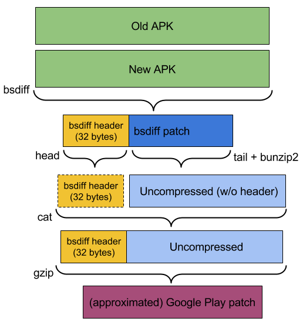

# APK patch size estimator
Estimates the size of a Google Play patch and the new gzipped APK.

From two APKs it estimates the size of the new patch as well as the size of the gzipped version of the new APK, which would be used in
cases where the patch is unexpectedly large, unavailable, or unsuitable.
Google Play uses multiple techniques to generate patches and generally picks the best match for the device. The best match is usually, but not always, the smallest patch file produced. The numbers that this script produces are **ESTIMATES** that can be used to characterize the impact of arbitrary changes to APKs. There is **NO GUARANTEE** that this tool produces the same patches or patch sizes that Google Play generates, stores or transmits, and the actual implementation within Google Play may change at any time, without notice.

***This is not an official Google product***

## Usage

The script uses *Python 2.7.X* and *bsdiff* (*bsdiff* is the only binary used not installed by defult in a unix based OS or Cygwin)

#### To estimate the patch size of two APKs run:
```bash
$ python apk_patch_size_estimator.py --old-file old.apk --new-file new.apk
```

#### Output:
```bash
Estimates:
New APK size on Disk: 6861218 bytes [6.54MB]
New APK Gzipped size (== Download size for new installs): 6863020 bytes [6.55MB]
Gzipped Bsdiff Patch Size (== Download size for updates from the old APK): 2228544 bytes [2.13MB]
```

## Patch estimation process
 

## Installing external dependencies
The script uses *bsdiff*, *gzip*, *head*, *tail* and *bunzip2* binaries, [**bsdiff**](https://www.freebsd.org/cgi/man.cgi?query=bsdiff) is the only one not installed by defult in a unix based OS.

#### Linux debian-based
Install bsdiff:
```bash
sudo apt-get install bsdiff
```

#### OS X
Install bsdiff using [Homebrew](http://brew.sh/):
```bash
brew install bsdiff
```

#### Windows

The easiest way to run the script in Windows is by using [Cygwin](https://www.cygwin.com/), make sure you install *python* and *bsdiff* using Cygwin's installer/setup.

## Runing the unittests

#### Install unittest.mock 
```bash
pip install mock
```

#### Run the test
```bash
python -m unittest discover tests/
```

## Authors
    Julian Toledo
    Andrew Hayden
